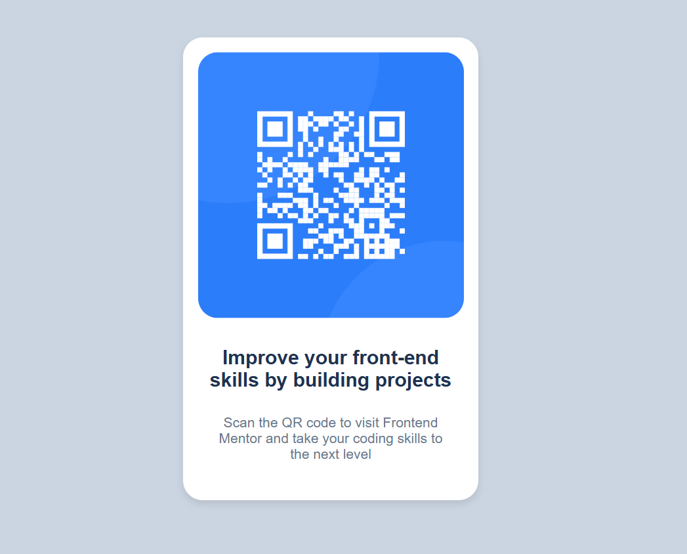

# Frontend Mentor - QR Code Component

## 🎯 Description du projet
Ce projet est une solution au défi **"QR Code Component"** de [Frontend Mentor](https://www.frontendmentor.io/). Il s'agit d'un petit composant affichant un code QR avec un style simple et moderne.

## 🚀 Technologies utilisées
- HTML5  
- CSS3  
- Git & GitHub  

## 📷 Aperçu du projet
Vous pouvez voir le projet en ligne ici :  
🔗 **[Démo en ligne](https://SaraBarkat.github.io/Qr-code-component-Frontend-Mentor/)** (si hébergé sur GitHub Pages)

